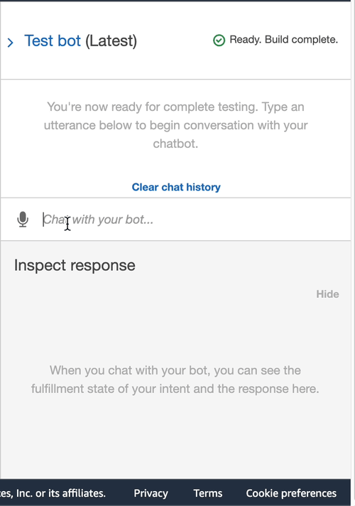
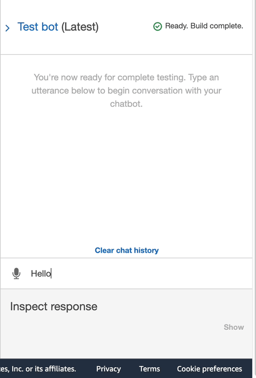

## Retirement RoboAdvisor

The Retirement RoboAdvisor is an interactive chatbot designed to provide personalized investment portfolio recommendations for users' retirement plans. This application harnesses the power of AWS services and Python to engage users in a conversation, collecting their retirement investment requirements and delivering tailored suggestions based on their input.

### Technologies

* AWS Services:
 * Amazon Lex - Conversational bot
 * Amazon Lambda - Serverless backend for data validation and processing
* Programming Language: [Python 3.7.13](https://www.python.org/downloads/release/python-385/)

### Bot Configurations

#### Initial RoboAdvisor Bot
The initial RoboAdvisor bot is set up with a single intent, `recommendPortfolio`, which initiates a conversation about the user's retirement investment requirements. It captures essential information such as the user's name, age, investment amount, and risk level preference using slots. Upon receiving this data, the bot provides a confirmation message before proceeding to suggest an appropriate investment portfolio.

#### RoboAdvisor Enhanced with Lambda Function
The enhanced RoboAdvisor integrates an Amazon Lambda function to validate the user's input and generate personalized investment portfolio recommendations based on their preferred risk level. The Lambda function checks that the user's age and investment amount fall within acceptable ranges before providing a tailored portfolio suggestion according to their risk preference.

### Project Steps Overview
#### Step 1: Configuring the Initial RoboAdvisor
During this step, a new Amazon Lex bot was created, and the `recommendPortfolio` intent was added. The necessary slots were configured to gather user input, and a confirmation prompt was set up to ensure user satisfaction before proceeding with the portfolio recommendation.

#### Step 2: Building and Testing the RoboAdvisor
After setting up the initial bot, it was built and tested using the Amazon Lex console's "Test bot" pane. The bot's accurate response and successful collection of the required user input were verified. A screenshot and video of the working bot was then captured and saved in the `screen_shots` folder.

#### Step 3: Enhancing the RoboAdvisor with an Amazon Lambda Function
In this step, a new Amazon Lambda function called `recommendPortfolio` was created using Python 3.7. Validation rules were implemented to ensure that the user's age and investment amount were within acceptable ranges. Logic was also added to generate investment recommendations based on the user's risk level preference.

Next, the Lambda function was tested using the test events stored in the repository folder `Test_Events` and integrated with the Amazon Lex bot by selecting it in the "Lambda initialization and validation" and "Fulfillment" sections. The bot was built and tested using both valid and invalid data for the slots. Finally, a screenshot and video showcasing the functioning bot were recorded and saved in the `screen_shots` folder.

### Contributors
Alexander Likhachev

### License
MIT